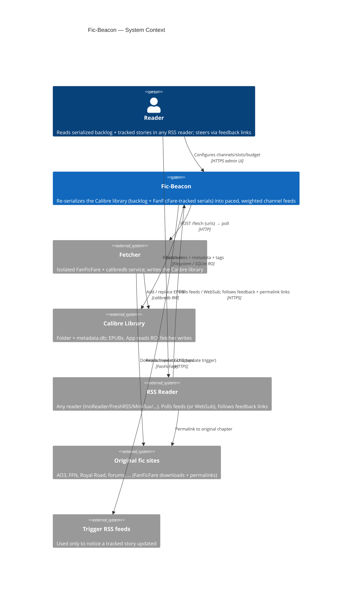
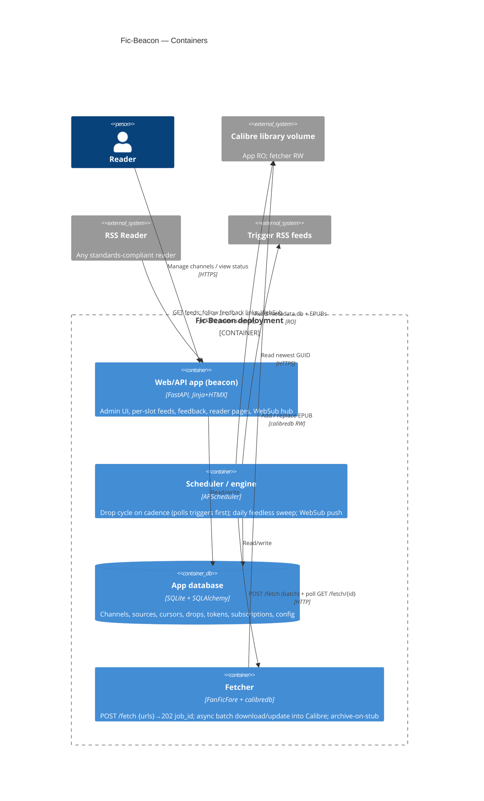
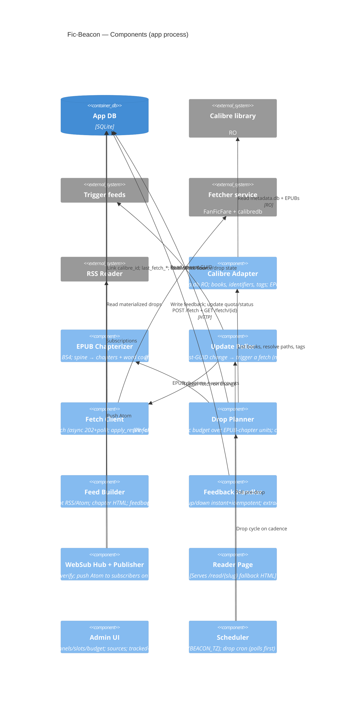

# Fic-Beacon — Architecture

## 1. Problem & Goal

The user reads a lot of fanfiction and web serials and stays engaged because they arrive as
**ongoing chapter drops in an RSS reader**. Meanwhile a large backlog of *complete* books sits
unread in a Calibre library — a finished work lacks the drip-fed "ongoing" hook. Worse, the real
ongoing serials arrive whenever their authors post, so they always feel more urgent than the
backlog and crowd it out.

**Fic-Beacon** makes itself the *single* batched reading queue for both. Everything is a Calibre
EPUB: the backlog is imported, and ongoing serials are downloaded into Calibre by **FanFicFare**
(their RSS feed used only as a *trigger* that new chapters exist). It re-serializes all of it into
synthetic *ongoing* RSS/Atom feeds, grouped into **channels**, delivered only at scheduled drop
times, and weighted so nothing gets implicit priority. Each drop carries inline feedback links so
the reader can steer attention, pull an extra chapter on demand, up/down-vote, or drop a source.

Three goals this serves directly:
- **(a)** ongoing updates arrive only at drop times (morning/evening), not as mid-day distractions;
- **(b)** ongoings are votable and droppable, their weight tunable *relative to* the backlog;
- **(c)** ongoings no longer outrank the completed backlog — the entire reason for the project.

### Hard constraint: reader-agnostic
Feeds MUST be **standards-compliant RSS 2.0 + Atom** and work in **any** RSS reader. InoReader is
a **reference client only** — no InoReader-specific dependencies. All feedback is plain `<a href>`
GET hyperlinks in item HTML. **WebSub** (W3C) is used for realtime push but degrades gracefully to
polling for readers that don't support it.

## 2. Landscape — build vs. reuse

No off-the-shelf tool serializes EPUB chapters *into* an RSS feed, or re-batches ongoing RSS at a
schedule with weighting. So Fic-Beacon is custom glue — but it leans on **FanFicFare** (site→EPUB)
for the one thing it does well: keeping serial EPUBs up to date in Calibre. Reusable building
blocks: `ebooklib` + BeautifulSoup (chapterizer), Calibre `metadata.db` (RO), `feedparser` (read a
trigger feed's newest GUID), `httpx` (WebSub push + calling the fetcher), `feedgen` (emit feeds),
FanFicFare + `calibredb` (the isolated fetcher container), FastAPI + APScheduler + SQLAlchemy +
SQLite, Jinja + HTMX.

## 3. Key Design Decisions

| Area | Decision |
|---|---|
| Calibre access | The app reads the library folder directly (mounted **read-only**); parses `metadata.db` (incl. **tags**) + EPUBs in place. **Writes happen only in the separate fetcher container.** No Calibre process needed by the app. |
| Fetcher | A separate, isolated container runs **FanFicFare + `calibredb`** (library RW). `POST /fetch {urls}` → `202 {job_id}`; it downloads/updates the EPUBs into Calibre in a background single-worker pool and exposes `GET /fetch/{job_id}` → per-URL `{calibre_id, chapter_count, stub?}`. The app submits batches and polls (FanFicFare can take ~15 min); it coexists with an external calibre-web on the same library. |
| Channels | **Every source belongs to exactly one channel** (`book.channel_id` NOT NULL) — no global/default group. Each channel has its own budget + parallel slots; the **cadence is global** (one cron). A **"General"** channel is auto-created on first run; books can be moved between channels and channels renamed (slug stays stable) from the admin UI. |
| Feed shape | **One feed per slot** (`/feed/{channel_slug}/{feed_key}`): numbered slots `1..N`. A slot is a feed *bucket* — it carries the one backlog book streaming in that slot **plus** the tracked stories pinned to it, interleaved. No all-channels union feed — subscribe per channel/slot. |
| Slots & caps | **Backlog (untracked) books stream one-at-a-time per slot** → at most `N = parallel_slots` active per channel (extras stay queued; a slot may hold zero). **Tracked stories are uncapped**, never queued, never "complete", and load-balanced (sticky) across the N slots. |
| Sources | One unified model: every source is a Calibre EPUB (`book.calibre_id`). A `tracked` flag (no `kind`) marks the ones that auto-update; `feed_url?` is an optional RSS trigger and `source_url` doubles as the FanFicFare fetch URL. All are weighted, votable, droppable, and live in a channel. |
| Tracked stories | RSS = **trigger only** (feed bodies are never read). Pre-drop, a changed newest-GUID drives a FanFicFare fetch into Calibre; feed-less (auth-gated) stories are refreshed by a daily sweep. Chapters then drop via the normal EPUB cursor path. |
| Stubs | If the site removed chapters, the fetcher archives the old EPUB as a separate Calibre entry and overwrites the book; the app bumps `chapter_label_offset` (labels stay continuous) and raises `cursor_floor` (can't rewind into the rewritten body). |
| Budgeting | **Per-channel, pure-stochastic.** Marginal whole units are included with a probability that falls as the cycle runs over budget; weight/votes bias the draw; a signed `budget_credit` carry-over makes the long-run mean track the budget. **Never split a unit.** |
| Feedback | Four tokenized GET links per drop: **🪝 extra (super-up) · 👍 up · 👎 down · ❌ drop (super-down)**. up/down fire instantly (bare GET, idempotent); extra/drop use a one-tap confirm page. `extra` shows only when a next unit exists. |
| Realtime | **Self-hosted WebSub hub**; feeds declare `rel=hub`; push on each new drop. Works on InoReader free plan. |
| Reader compatibility | Standards-compliant RSS 2.0 + Atom; verified in ≥2 readers + W3C Feed Validator. |
| Permalinks | Source-aware and uniform (all sources are FanFicFare EPUBs): per-chapter `chapterurl` → whole-work `url:` identifier → reader page. `guid` always per-drop and independent of link. |
| Stack | Python + FastAPI + SQLite, Jinja + HTMX. Two Docker containers: `beacon` (app, library RO) + `fetcher` (FanFicFare/calibredb, library RW). |

## 4. C4 Model

### 4.1 System Context (C1)

### 4.2 Containers (C2)

### 4.3 Components (C3, inside the app)

## 5. Data Model

- **`channel`** — `id`, `name`, `slug`, `genre_match` (#genre_manual prefix), `parallel_slots`,
  `budget_words`, `budget_minutes`, `budget_mode`, `budget_credit` (signed carry-over),
  `queue_order`.
- **`book`** (a *source*) — `calibre_id?`, `tracked` (bool; auto-updating), `feed_url?` (RSS
  trigger), `last_seen_guid?`, `last_fetch_at?`, `last_fetch_status?`, `title`, `author`,
  `source_url?` (whole-work URL = FanFicFare fetch URL), `total_chapters?`, `status`
  (`queued|active|completed|dropped`), `channel_id` (**NOT NULL**), `slot_index?` (pinned feed slot;
  unique per active backlog book, *shared* by tracked stories pinned to it), `queue_position`,
  `quota_weight`, `cursor_chapter_index` (physical EPUB index), `chapter_label_offset` (stub
  continuity), `cursor_floor` (lowest rewindable index), `thumbs_up`, `thumbs_down`, `added_at`.
- **`drop`** — `id`, `book_id`, `channel_id`, `feed_key` (`"1".."N"`, = source's pinned slot),
  `created_at`, `published_at`, `word_count`, `chapter_start`, `chapter_end`, `chapter_titles`,
  `source_url?`, `content_html`, `feedback_token` (unguessable), `reader_slug`.
- **`feedback_event`** — `id`, `token`, `book_id`, `drop_id`, `action`
  (`up|down|extra|drop`), `created_at`.
- **`websub_subscription`** — `id`, `topic_url`, `callback_url`, `secret?`, `lease_expires_at`,
  `verified`, `created_at`.
- **`config`** — single-row globals only: `wpm`, `cadence_cron`, `thumbs_down_drop_threshold`,
  `feed_secret`. (Budget, slots, and budget-mode live per-channel, not here.)
- **`app_state`** — key/value runtime store (`key`, `value`, `updated_at`); holds
  `last_drop_run_at` / `last_poll_run_at` for the dashboard. A standalone table so `create_all`
  adds it on existing volumes without a migration.

## 6. Core Flows

### 6.1 Broadcast cycle (scheduled, per channel)
1. Scheduler fires on `cadence_cron` (in `BEACON_TZ`) and **polls every trigger feed first**
   (§6.2): any tracked story whose newest GUID changed is fetched into Calibre *now*, so the
   broadcast reads the freshest EPUB state. The manual "Run drop cycle" trigger does the same.
2. For each channel, **assign slots** (`_assign_slots`): promote queued backlog books into free
   slots up to `parallel_slots` (≤ N active, one per slot; sticky), and pin every active tracked
   story to a balanced slot (fewest pinned works, tie-break fewest chapters ever dropped there;
   sticky). Then gather each active source's **next unit** — every backlog book's next chapter plus
   every tracked story with a chapter past its cursor (tracked are uncapped).
3. Run the **stochastic pass** (slot-agnostic, channel-wide): `B = budget + budget_credit`; include
   each marginal whole unit with `p = clamp((B − used)/w, 0, 1)`, weight-biased; excluded units roll
   over whole. Never split. Then `budget_credit += budget − used`.
4. Materialize a `drop` per emitted unit (`feed_key` = source's pinned slot); advance cursors;
   complete+free **backlog** books that ran out (next queued book rebalances in). A **tracked** book
   that runs out is *not* completed — it self-gates until the next fetch adds chapters. Sources whose
   units rolled over are recorded in the per-broadcast skip log (`app_state`).
5. WebSub push fires for each affected slot-feed (subscribers matched with or without the `?token=`).

### 6.2 Update detection & fetch (pre-drop submit, async; daily sweep for feed-less)
The poller reads each tracked, feed-backed source's `feed_url` and compares the newest entry GUID
to `last_seen_guid`. Changed sources are **batched** and handed to `scheduler.submit_and_track`,
which POSTs all their URLs to the fetcher in one request. Because a FanFicFare run can take ~15 min,
the call is **asynchronous**: the fetcher returns a `job_id` (HTTP 202) and works in the background
(a single-worker pool → serialized `calibredb` writes; new stories share one warm `fanficfare -i`
pass; existing ones update per-story with force-detection + a 3-try backoff). The app marks the
books `fetching…`, persists the `job→book` map in `app_state`, and a transient `fetch_poll_{id}`
interval job polls `GET /fetch/{job_id}` — surfacing each book's live `phase` on the dashboard —
until `done`, then folds each result (`apply_result`). On a **stub** (`old > new`) it bumps
`chapter_label_offset` by `old − new`, sets the cursor to `new`, and raises `cursor_floor` to `new`.
The triggering broadcast does **not** wait; fetched chapters drop on the **next** cycle. Tracked
stories with **no** feed (auth-gated, fetchable only via `personal.ini`) are refreshed by a **daily
sweep**. No feed body is ever stored — RSS is purely a trigger.

Both the poller and the sweep **skip** tracked stories whose Calibre **`#status`** is done
(Completed / Abandoned / Published — see `app/calibre/status.py`, read live via
`CalibreAdapter.status_map`): their EPUBs are already complete, so re-fetching just burns fetcher
time; already-downloaded chapters still drop through the cursor path.

### 6.3 Library import — routed by `#status` / `#read`
The Library page's single **Add** button (`POST /admin/library/add`) routes each selected Calibre
book by its `#status`: an **updating** status (In-Progress / Incomplete / Hiatus) creates a
**tracked** auto-updating source; a **done**/blank status creates a **backlog** queue entry. The
books already live in Calibre, so tracked ones need no initial fetch. For a tracked book the cursor
starts at the **current EPUB end** when `#read=Yes` (the user has caught up → only new chapters
drop) and at chapter 1 otherwise. Chapter count comes from chapterizing the existing EPUB.

### 6.3 Feedback (reader click)
- `GET /fb/{token}?action=up|down` — **instant**, idempotent per `(drop, action)`. `up`: thumbs+,
  weight ×1.25. `down`: thumbs+, weight ×0.8; at threshold → `dropped` + promote next.
- `GET /fb/confirm/{token}?action=extra|drop` → confirm page → POST. `extra`: +3 thumbs, strong
  weight boost, inject an out-of-cycle drop (shown only when a next unit exists). `drop`: set
  source `dropped` immediately + promote next.

### 6.4 Permalink resolution
Uniform across all sources (every book is a FanFicFare EPUB): (1) the drop's first-chapter
`chapterurl`, (2) whole-work `url:` identifier, (3) `/read/{slug}`. `guid`/`id` is always
`urn:fic-beacon:drop:{slug}`, independent of the link, so multiple drops never collapse.

### 6.5 WebSub
Feeds advertise `<link rel="hub">`. A reader's hub subscribes via `POST /websub/hub`; Fic-Beacon
verifies intent (GET callback with `hub.challenge`) and stores the subscription. On each new drop,
the publisher POSTs the Atom body to verified subscribers (with `X-Hub-Signature` when a secret
was registered). Readers without WebSub simply keep polling.

## 7. Security & Access

- Single-user. Feed URLs carry the secret `feed_secret`; feedback links carry per-drop tokens.
- The admin UI sits behind the user's reverse proxy / basic auth.
- The Calibre volume is mounted **read-only in the `beacon` app**; only the isolated `fetcher`
  container writes it. All app state lives in the app SQLite DB. Site logins live in the fetcher's
  `personal.ini` (never in the app DB).
- WebSub callbacks are verified (intent check) and bound to our own topic URLs only.

## 8. History — earlier ongoing models (superseded)

- **v2 "budget balancing"** imported ongoing feeds only to *count recent words* and shrink the
  synthetic budget — superseded by channels + in-budget weighting.
- **v0.3–0.4 "RSS-body syndication"** buffered ongoing RSS **entry bodies** as content
  (`ongoing_entry`) and released them at drop time. This broke once it was clear sites syndicate
  only a *preview*, not full text. Superseded by §6.2: RSS is a trigger and FanFicFare provides the
  real chapters as Calibre EPUBs. The `ongoing_entry` table and `BookKind` are removed.

## 9. Future / out of scope (now)

- **RSSHub as an input** to synthesize trigger feeds for serial sites that lack RSS.
- Surfacing fetcher errors (login failures, rate limits) more richly in the dashboard beyond the
  per-source `last_fetch_status`.
