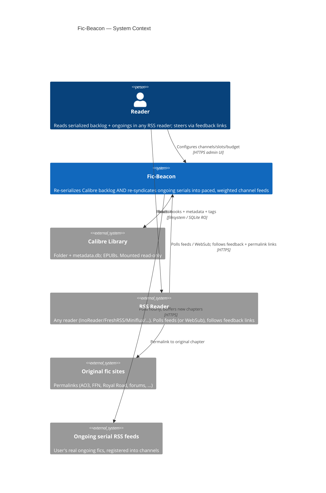
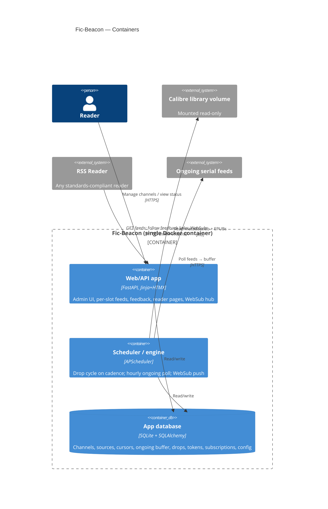
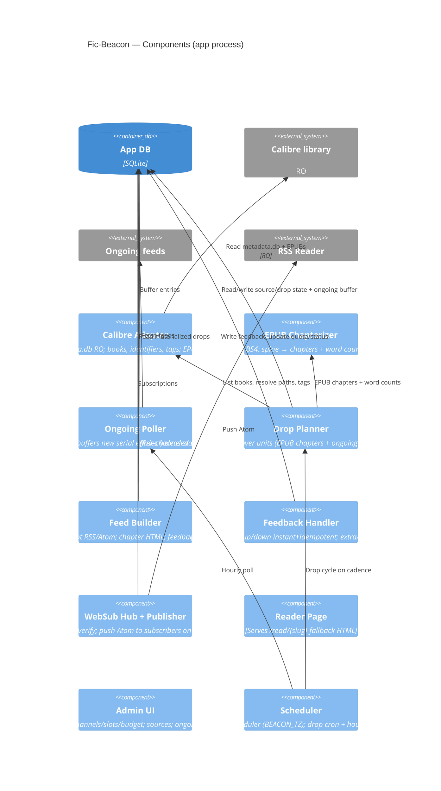

# Fic-Beacon — Architecture

## 1. Problem & Goal

The user reads a lot of fanfiction and web serials and stays engaged because they arrive as
**ongoing chapter drops in an RSS reader**. Meanwhile a large backlog of *complete* books sits
unread in a Calibre library — a finished work lacks the drip-fed "ongoing" hook. Worse, the real
ongoing serials arrive whenever their authors post, so they always feel more urgent than the
backlog and crowd it out.

**Fic-Beacon** makes itself the *single* batched reading queue for both. It re-serializes
complete EPUBs **and** re-syndicates the user's real ongoing serials into synthetic *ongoing*
RSS/Atom feeds, grouped into **channels**, delivered only at scheduled drop times, and weighted
so nothing gets implicit priority. Each drop carries inline feedback links so the reader can
steer attention, pull an extra chapter on demand, up/down-vote, or drop a source.

Three goals this serves directly:
- **(a)** ongoing updates arrive only at drop times (morning/evening), not as mid-day distractions;
- **(b)** ongoings are votable and droppable, their weight tunable *relative to* the backlog;
- **(c)** ongoings no longer outrank the completed backlog — the entire reason for the project.

### Hard constraint: reader-agnostic
Feeds MUST be **standards-compliant RSS 2.0 + Atom** and work in **any** RSS reader. InoReader is
a **reference client only** — no InoReader-specific dependencies. All feedback is plain `<a href>`
GET hyperlinks in item HTML. **WebSub** (W3C) is used for realtime push but degrades gracefully to
polling for readers that don't support it.

## 2. Landscape — build vs. reuse

No off-the-shelf tool serializes EPUB chapters *into* an RSS feed, or re-batches ongoing RSS at a
schedule with weighting. Adjacent tools run the opposite direction (FanFicFare: site→EPUB;
rss-epub-archiver / Calibre "Fetch News": RSS→EPUB; Calibre OPDS: whole-file only). So Fic-Beacon
is custom glue. Reusable building blocks: `ebooklib` + BeautifulSoup (chapterizer), Calibre
`metadata.db` (RO), `feedparser` (poll ongoing feeds), `httpx` (WebSub), `feedgen` (emit feeds),
FastAPI + APScheduler + SQLAlchemy + SQLite, Jinja + HTMX.

## 3. Key Design Decisions

| Area | Decision |
|---|---|
| Calibre access | Read the library folder directly (mounted **read-only**); parse `metadata.db` (incl. **tags**) + EPUBs in place. No Calibre process. |
| Channels | **Every source belongs to exactly one channel** (`book.channel_id` NOT NULL) — no global/default group. Each channel has its own budget + parallel slots; the **cadence is global** (one cron). A **"General"** channel is auto-created on first run; books can be moved between channels and channels renamed (slug stays stable) from the admin UI. |
| Feed shape | **One feed per slot** (`/feed/{channel_slug}/{feed_key}`): numbered slots `1..N`. A slot is a feed *bucket* — it carries the one EPUB streaming in that slot **plus** the ongoings pinned to it, interleaved. No all-channels union feed — subscribe per channel/slot. |
| Slots & caps | **EPUBs stream one-at-a-time per slot** → at most `N = parallel_slots` active EPUBs per channel (extras stay queued; a slot may hold zero EPUBs). **Ongoings are uncapped**, never queued, and load-balanced (sticky) across the N slots. |
| Sources | EPUB backlog books and ongoing serials are unified as **sources** (`book.kind`). Both are weighted, votable, droppable, and live in a channel. |
| Ongoing serials | Polled hourly into a buffer; **released only at broadcast time**, competing in the channel's weighted budget like EPUBs. Content embedded from the RSS entry as-is (summary-only → "new chapter" notice + link). |
| Budgeting | **Per-channel, pure-stochastic.** Marginal whole units are included with a probability that falls as the cycle runs over budget; weight/votes bias the draw; a signed `budget_credit` carry-over makes the long-run mean track the budget. **Never split a unit.** |
| Feedback | Four tokenized GET links per drop: **🪝 extra (super-up) · 👍 up · 👎 down · ❌ drop (super-down)**. up/down fire instantly (bare GET, idempotent); extra/drop use a one-tap confirm page. `extra` shows only when a next unit exists. |
| Realtime | **Self-hosted WebSub hub**; feeds declare `rel=hub`; push on each new drop. Works on InoReader free plan. |
| Reader compatibility | Standards-compliant RSS 2.0 + Atom; verified in ≥2 readers + W3C Feed Validator. |
| Permalinks | Source-aware: EPUB → per-chapter FanFicFare URL → whole-work URL → reader page; ongoing → entry's original chapter URL. `guid` always per-drop and independent of link. |
| Stack | Python + FastAPI + SQLite (+ Alembic), Jinja + HTMX, one Docker container. |

## 4. C4 Model

### 4.1 System Context (C1)

### 4.2 Containers (C2)

### 4.3 Components (C3, inside the app)

## 5. Data Model

- **`channel`** — `id`, `name`, `slug`, `genre_match` (#genre_manual prefix), `parallel_slots`,
  `budget_words`, `budget_minutes`, `budget_mode`, `budget_credit` (signed carry-over),
  `queue_order`.
- **`book`** (a *source*) — `calibre_id?`, `kind` (`epub|ongoing`), `feed_url?`, `title`,
  `author`, `source_url?`, `total_chapters?`, `status` (`queued|active|completed|dropped`),
  `channel_id` (**NOT NULL** — every source lives in a channel), `slot_index?` (pinned feed slot;
  unique per active EPUB, *shared* by the ongoings pinned to it), `queue_position`,
  `quota_weight`, `cursor_chapter_index`, `thumbs_up`, `thumbs_down`, `added_at`.
- **`ongoing_entry`** (buffer) — `id`, `source_id`, `guid` (unique per source), `title`, `link`,
  `content_html`, `word_count`, `published_at`, `released` (bool), `drop_id?`.
- **`drop`** — `id`, `book_id`, `channel_id`, `feed_key` (`"1".."N"`, = source's pinned slot),
  `created_at`, `published_at`, `word_count`, `chapter_start`, `chapter_end`, `chapter_titles`,
  `source_url?`, `content_html`, `feedback_token` (unguessable), `reader_slug`.
- **`feedback_event`** — `id`, `token`, `book_id`, `drop_id`, `action`
  (`up|down|extra|drop`), `created_at`.
- **`websub_subscription`** — `id`, `topic_url`, `callback_url`, `secret?`, `lease_expires_at`,
  `verified`, `created_at`.
- **`config`** — single-row globals only: `wpm`, `cadence_cron`, `thumbs_down_drop_threshold`,
  `feed_secret`. (Budget, slots, and budget-mode live per-channel, not here.)

## 6. Core Flows

### 6.1 Broadcast cycle (scheduled, per channel)
1. Scheduler fires the Planner on `cadence_cron` (in `BEACON_TZ`).
2. For each channel, **assign slots** (`_assign_slots`): promote queued EPUBs into free slots up to
   `parallel_slots` (≤ N active EPUBs, one per slot; sticky), and pin every active ongoing to a
   balanced slot (fewest pinned works, tie-break fewest chapters ever dropped there; sticky). Then
   gather each active source's **next unit** — every active EPUB's next chapter plus every ongoing
   with a buffered entry (ongoings are uncapped).
3. Run the **stochastic pass** (slot-agnostic, channel-wide): `B = budget + budget_credit`; include
   each marginal whole unit with `p = clamp((B − used)/w, 0, 1)`, weight-biased; excluded units roll
   over whole. Never split. Then `budget_credit += budget − used`.
4. Materialize a `drop` per emitted unit (`feed_key` = source's pinned slot); advance EPUB cursors /
   mark ongoing entries released; complete+free EPUBs that ran out (next queued EPUB rebalances in).
5. WebSub push fires for each affected slot-feed.

### 6.2 Ongoing buffering (hourly)
The poller fetches each `kind=ongoing` source's `feed_url`, inserts new entries (deduped by
`guid`) as `released=False`. Entries are held until a drop cycle releases them — so ongoing
chapters arrive batched at drop time, not whenever posted.

### 6.3 Feedback (reader click)
- `GET /fb/{token}?action=up|down` — **instant**, idempotent per `(drop, action)`. `up`: thumbs+,
  weight ×1.25. `down`: thumbs+, weight ×0.8; at threshold → `dropped` + promote next.
- `GET /fb/confirm/{token}?action=extra|drop` → confirm page → POST. `extra`: +3 thumbs, strong
  weight boost, inject an out-of-cycle drop (shown only when a next unit exists). `drop`: set
  source `dropped` immediately + promote next.

### 6.4 Permalink resolution
EPUB: (1) drop's first-chapter FanFicFare URL, (2) whole-work `url:` identifier, (3) `/read/{slug}`.
Ongoing: the entry's original chapter URL. `guid`/`id` is always `urn:fic-beacon:drop:{slug}`,
independent of the link, so multiple drops never collapse.

### 6.5 WebSub
Feeds advertise `<link rel="hub">`. A reader's hub subscribes via `POST /websub/hub`; Fic-Beacon
verifies intent (GET callback with `hub.challenge`) and stores the subscription. On each new drop,
the publisher POSTs the Atom body to verified subscribers (with `X-Hub-Signature` when a secret
was registered). Readers without WebSub simply keep polling.

## 7. Security & Access

- Single-user. Feed URLs carry the secret `feed_secret`; feedback links carry per-drop tokens.
- The admin UI sits behind the user's reverse proxy / basic auth.
- The Calibre volume is mounted **read-only**; all state lives in the app SQLite DB.
- WebSub callbacks are verified (intent check) and bound to our own topic URLs only.

## 8. History — superseded "v2 balancing"

An earlier design (v2) imported the user's ongoing feeds only to *count recent words* and shrink
the synthetic budget by that volume. It is **superseded** by §1/§6: ongoings are now first-class
sources syndicated through channels and weighted in-budget, which delivers goals (a)–(c) directly
instead of merely subtracting a word estimate. The old `ongoing_feed` table, `target_total_words`
config, and budget-subtraction are removed.

## 9. Future / out of scope (now)

- **AO3 & FFN** have no per-chapter RSS (user uses email notifications); **FFN via FanFicFare**
  needs a proxy + flaresolverr; **QuestionableQuesting** needs login. In-scope sources today are
  full-text RSS serials (e.g. Royal Road) and RSSHub-generated feeds.
- **FanFicFare/RSSHub as inputs** (to fetch full chapter text or synthesize RSS for sites lacking
  it) are a later phase; any fetched EPUBs would live in Fic-Beacon's own writable dir, never in
  the read-only Calibre library.
