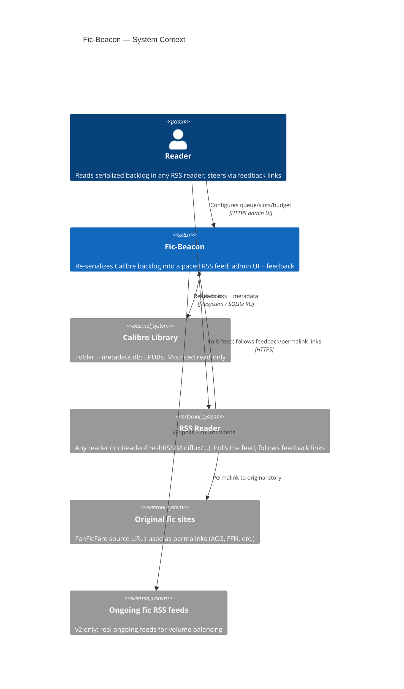
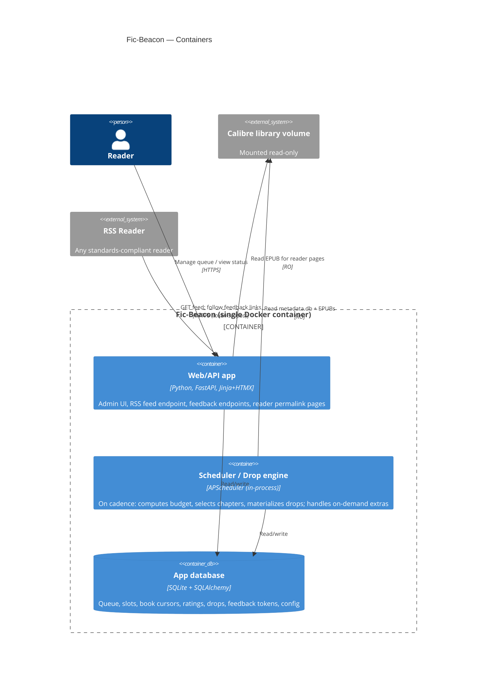
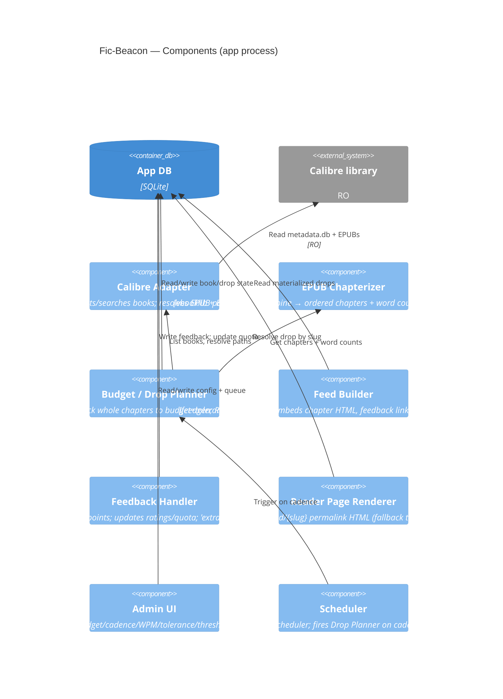

# Fic-Beacon — Architecture

## 1. Problem & Goal

The user reads a lot of fanfiction and web serials and stays engaged because they arrive as
**ongoing chapter drops in an RSS reader**. Meanwhile a large backlog of *complete* books and
fanfics sits unread in a Calibre library — a finished work lacks the drip-fed "ongoing" hook
that keeps the user coming back.

**Fic-Beacon** re-serializes complete EPUBs from a Calibre library into a synthetic *ongoing*
feed: it splits books into paced chapter drops and publishes them as a single self-hosted
RSS/Atom feed. A web admin page configures the reading queue, how many books are "beamed" in
parallel, and the per-cycle reading budget (word count / reading time). Each drop carries
inline feedback links so the reader can steer attention, pull an extra chapter on demand, or
drop a book.

### Hard constraint: reader-agnostic

The feed MUST be **standards-compliant RSS 2.0 + Atom** and work in **any** RSS reader
(FreshRSS, Miniflux, NetNewsWire, Feedly, etc.). InoReader is the user's current client and
serves as a **reference client only** — there must be **no InoReader-specific dependencies or
extensions**. All interactivity (feedback) is implemented as plain `<a href>` GET hyperlinks
embedded in item HTML, which every reader that renders content can follow.

## 2. Landscape — build vs. reuse

No off-the-shelf tool serializes EPUB chapters *into* an RSS feed. Adjacent tools all run the
opposite direction:

| Tool | Direction | Relevance |
|---|---|---|
| FanFicFare | fic site → EPUB | Source of many library books; stores the original story URL we use for permalinks. |
| rss-epub-archiver | RSS → EPUB | Opposite direction. |
| Calibre "Fetch News" | RSS → EPUB | Opposite direction. |
| Calibre Content Server / OPDS / calibre-rest | library → HTTP | Whole-file granularity only; no chapter-level reading. |

So Fic-Beacon is a custom glue app. Reusable building blocks:

- **`ebooklib` + BeautifulSoup** — open EPUBs, iterate the spine, extract per-chapter HTML and
  word counts (core of the chapterizer).
- **Calibre `metadata.db`** (SQLite) — book list, metadata, identifiers (incl. the FanFicFare
  `url:` source). Read directly, **read-only**.
- **`feedgen`** — emit standards-compliant RSS 2.0 / Atom. (**RSSHub is not required** — we
  generate our own feed.)
- **FastAPI + APScheduler + SQLAlchemy + SQLite** — app, scheduling, persistence.
- **Jinja + HTMX** — single-user server-rendered admin UI.

## 3. Key Design Decisions

| Area | Decision |
|---|---|
| Calibre access | Read the library folder directly (mounted **read-only**); parse `metadata.db` + EPUBs in place. No Calibre process, no extra container. |
| Feed shape | Single combined feed, full chapter text embedded inline. |
| Reader compatibility | Standards-compliant RSS 2.0 + Atom, no client-specific extensions; verified in ≥2 readers + W3C Feed Validator. |
| Batching | Pack **whole chapters** up to the budget, allow overshoot within a tolerance, **never split a chapter** — an oversized chapter posts whole. |
| Oversized chapters | Post whole; permalink is the truncation fallback for readers that clip long items. |
| Permalinks | **Source-aware:** FanFicFare books → original web story URL (`dc:source` / Calibre `url:` identifier); others → self-hosted reader page. A reader page always exists as the fallback `guid`/link. |
| Parallelism / budget | One **global budget per cycle**, split across the N active books, weighted by per-book quota. |
| Feedback | Every drop embeds tokenized plain-hyperlink GET links: **request-extra-now**, **thumbs-up**, **thumbs-down**. 👍 raises a book's quota weight; 👎 past a threshold drops the book. |
| Stack | Python + FastAPI + SQLite, server-rendered Jinja + HTMX, one Docker container. |
| v2 balancing | Out of scope for v1; schema designed to add OPML import + ongoing-feed polling later. |

## 4. C4 Model

### 4.1 System Context (C1)

### 4.2 Containers (C2)

### 4.3 Components (C3, inside the app)

## 5. Data Model

- **`book`** — `calibre_id`, `title`, `author`, `source_url` (nullable),
  `total_chapters`, `status` (`queued|active|completed|dropped`), `queue_position`,
  `quota_weight`, `cursor_chapter_index`, `thumbs_up`, `thumbs_down`, `added_at`.
- **`drop`** — `id`, `book_id`, `created_at`, `published_at`, `word_count`,
  `chapter_start`, `chapter_end`, `feedback_token` (unguessable), `reader_slug`.
- **`feedback_event`** — `id`, `token`, `book_id`, `drop_id`, `action` (`up|down|extra`),
  `created_at`.
- **`config`** — `global_budget_words`, `budget_mode` (`words|minutes`), `wpm`,
  `overshoot_tolerance`, `parallel_slots`, `cadence_cron`, `thumbs_down_drop_threshold`,
  `feed_secret`.
- *(v2, designed-for, not built)* **`ongoing_feed`** — OPML-imported feeds + rolling word
  volume, subtracted from the global target.

## 6. Core Flows

### 6.1 Drop cycle (scheduled)
1. Scheduler fires the Drop Planner on `cadence_cron`.
2. Planner computes the global budget for the cycle and splits it across active books by
   normalized `quota_weight`.
3. For each active book, starting at `cursor_chapter_index`, pack **whole chapters** until the
   book's share is reached (allowing overshoot up to `overshoot_tolerance`); never split a
   chapter — an oversized chapter is posted whole.
4. Materialize a `drop` per book, advance the cursor. If the cursor passes the last chapter,
   mark the book `completed` and promote the next `queued` book into the freed slot.
5. Feed Builder regenerates the feed from the latest N drops.

### 6.2 Feedback (reader click)
- `GET /fb/{token}?action=up|down|extra` validates the per-drop token.
  - `up` → increment `thumbs_up`, raise `quota_weight`.
  - `down` → increment `thumbs_down`; if `thumbs_down >= threshold`, set book `dropped` and
    promote the next queued book.
  - `extra` → inject an immediate out-of-cycle drop for that book.

### 6.3 Permalink resolution (per-chapter, source-aware)
FanFicFare embeds a canonical **per-chapter** URL in each chapter's `<head>`
(`<meta name="chapterurl">`) — the exact AO3 chapter, FFN chapter number, forum post, or
Wattpad part. The chapterizer extracts it from the raw EPUB zip (ebooklib drops `<head>`).
Item link precedence: (1) the drop's first-chapter URL, (2) the whole-work `url:` identifier,
(3) the self-hosted reader page `/read/{slug}`.

The item **`guid`/`id` is independent of the link** — always `urn:fic-beacon:drop:{slug}`
(per-drop uuid4) — because several drops of one FanFicFare book share the same work URL and
would otherwise be collapsed into a single item by readers. The reader page always exists as
a stable fallback for clients that truncate long items.

## 7. Security & Access

- Single-user. The **feed URL carries a secret token** (`feed_secret`); **feedback links carry
  per-drop tokens** so a click is bound to exactly one book/drop.
- The admin UI sits behind the user's reverse proxy / basic auth.
- The Calibre volume is mounted **read-only** — Fic-Beacon never writes to Calibre; all state
  lives in its own SQLite DB.

## 8. v2 Extension Point — Ongoing-feed balancing

The user's *real* ongoing fics already arrive as RSS feeds (exportable via OPML). v2 will:
1. Import OPML into `ongoing_feed`.
2. Periodically poll those feeds and estimate recent word volume.
3. Set the synthetic global budget as `target_total − recent_ongoing_volume`, so the combined
   daily reading volume (ongoing + synthetic) tracks a target.

The `config` (global target) and the per-cycle budget computation in the Planner are the only
seams this touches; the rest of the system is unchanged.
